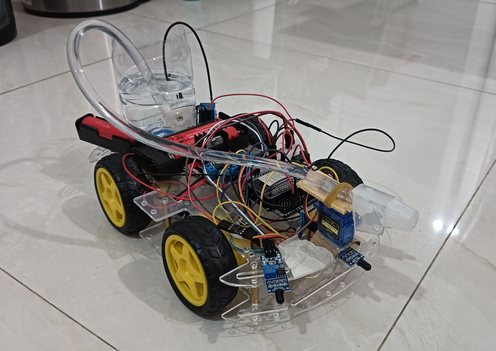

# Smart Firefighting Robot

This project contains the Arduino/ESP32 code for an autonomous smart firefighting robot. The robot is equipped with flame sensors to detect fire, DC motors to navigate towards the fire, and a water pump mounted on a servo motor to extinguish the fire.

## Features

- **Autonomous Fire Detection**: Uses three analog flame sensors (Left, Center, Right) to detect the presence and direction of a fire.
- **Directional Navigation**: Automatically drives the motors to move the robot forward, left, or right towards the detected fire.
- **Fire Extinguishing Mechanism**: Controls a water pump via a relay to spray water onto the fire.
- **Sweeping Operation**: Uses a servo motor to sweep the water pump back and forth (5° to 175°) to cover a wider area while extinguishing the fire.

## Hardware Components

- **Microcontroller**: ESP32
- **Sensors**: 3x Flame Sensors (Analog)
- **Actuators**:
  - 2x DC Motors (connected via a motor driver, e.g., L298N)
  - 1x Servo Motor (for sweeping the water nozzle)
  - 1x Water Pump (controlled via a relay module)

## Pin Configuration

| Component             | Pin(s) on ESP32         |
| :-------------------- | :---------------------- |
| Flame Sensor (Left)   | 34 (Analog Input)       |
| Flame Sensor (Center) | 35 (Analog Input)       |
| Flame Sensor (Right)  | 32 (Analog Input)       |
| Motor Left 1 (L1)     | 25 (Digital Output)     |
| Motor Left 2 (L2)     | 26 (Digital Output)     |
| Motor Right 1 (R1)    | 27 (Digital Output)     |
| Motor Right 2 (R2)    | 14 (Digital Output)     |
| Water Pump Relay      | 21 (Digital Output)     |
| Servo Motor           | 13 (PWM / Servo Output) |

## How It Works

1. **Sensing**: In the loop, the robot constantly reads analog values from its three flame sensors. A lower analog reading indicates a stronger fire signal.
2. **Thresholding**: If the minimum reading drops below the `FIRE_DETECTED_THRESHOLD` (2000), the robot is triggered.
3. **Movement**:
   - The robot compares the sensor values to determine the location of the fire.
   - It will trigger a movement command (`moveForward()`, `turnLeft()`, or `turnRight()`) for a duration of `MOVE_DURATION` (500 ms).
   - After 500 ms, the motors stop to prevent the robot from overshooting or colliding.
4. **Spraying**:
   - While a fire is detected, the relay activates the water pump (`digitalWrite(RELAY_PIN, LOW)`).
   - Concurrently, the servo sweeps back and forth between 5 degrees and 175 degrees to accurately spray water.
5. **Standby**: When no fire is detected, the motors stop, the pump is turned off, and the servo returns to a neutral 90-degree position.

## Installation and Setup

1. Assemble the hardware based on the pin configuration table.
2. Ensure the motors are correctly wired to your motor driver.
3. Install the **ESP32 Boards Package** in your Arduino IDE if you haven't already.
4. Install the **ESP32Servo** library from the Library Manager.
5. Compile and upload `FireFighterFinal.ino` to your ESP32 board.
6. Open the Serial Monitor at `115200` baud rate if you wish to add debugging output later.
